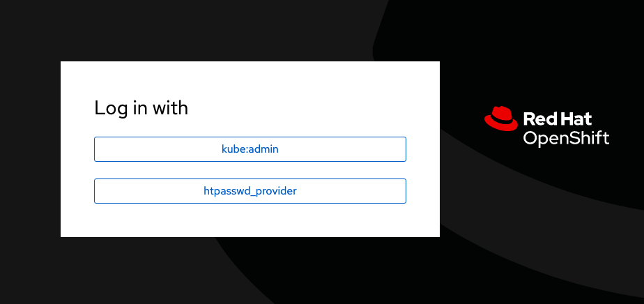

:guid: %guid%,
:openshift_cluster_console_url: %openshift_cluster_console_url%,
:openshift_cluster_admin_username: %openshift_cluster_admin_username%,
:openshift_cluster_admin_password: %openshift_cluster_admin_password%,

=== Create Application On Primary

[arabic]
. Go to the %openshift_cluster_console_url%/[OpenShift
console] and log in with your credentials username: %openshift_cluster_admin_username% and password: %openshift_cluster_admin_password%.
+

. Upon successful login, you will see the Red Hat OpenShift Dedicated environment. This is a kubernetes platform from which you can create containerized applications. Part of this environment is the Red Hat Advanced Cluster Management (RHACM) platform along with Red Hat Openshift Disaster Recovery with ODF. To get started, you will need to access the RHACM plaftorm by clicking *local-cluster* from the left menu and then selecting *All Clusters*.
+
image:images/openshift-acm-menu.png[images/openshift-acm-menu.png]
. Upon clicking the *All Cluster* option, you will be redirected to the RHACM console displaying your available clusters.  There are 3 clusters available:
... local-cluster: This is your management cluster where you will create, failover and relocate your application.
... primary: Your main cluster where your applications are initially deployed to.
... secondary: Your backup cluster where your applications are failed over to.
+

+
. You will now need to create your application which we will use in this workshop.  Click on *Applications* on the left menu and click *Create application->Subscription*
+
image:images/rhacm-create-application.png[images/rhacm-create-application.png]
. Once in the *Create application* wizard, enter the following details:
.. *Name*: globex
.. *Namespace*: globex
.. Under *Repository location for resources*:
... *Repository Types*: Git
... *URL*: https://github.com/redhat-gpte-devopsautomation/globex.git
... *Branch*: main
.. Under *Select clusters for application deployment*:
... Select *Deploy application resources on clusters with all specified labels*
.... *Label*: name
.... *Value*: primary
.. Your yaml on the right of your screen should look like this:
+
[source, yaml]
----
apiVersion: v1
kind: Namespace
metadata:
  name: globex
---
apiVersion: app.k8s.io/v1beta1
kind: Application
metadata:
  name: globex
  namespace: globex
spec:
  componentKinds:
  - group: apps.open-cluster-management.io
    kind: Subscription
  descriptor: {}
  selector:
    matchExpressions:
      - key: app
        operator: In
        values:
          - globex
---
apiVersion: apps.open-cluster-management.io/v1
kind: Channel
metadata:
  annotations:
    apps.open-cluster-management.io/reconcile-rate: medium
  name: ggithubcom-redhat-gpte-devopsautomation-globex
  namespace: ggithubcom-redhat-gpte-devopsautomation-globex-ns
spec:
  type: Git
  pathname: 'https://github.com/redhat-gpte-devopsautomation/globex.git'
---
apiVersion: apps.open-cluster-management.io/v1
kind: Subscription
metadata:
  annotations:
    apps.open-cluster-management.io/git-branch: 'main'
    apps.open-cluster-management.io/git-path: ''
    apps.open-cluster-management.io/reconcile-option: merge
  labels:
    app: globex
  name: globex-subscription-1
  namespace: globex
spec:
  channel: ggithubcom-redhat-gpte-devopsautomation-globex-ns/ggithubcom-redhat-gpte-devopsautomation-globex
  placement:
    placementRef:
      kind: PlacementRule
      name: globex-placement-1
---
apiVersion: apps.open-cluster-management.io/v1
kind: PlacementRule
metadata:
  labels:
    app: globex
  name: globex-placement-1
  namespace: globex
apiVersion: v1
kind: Namespace
metadata:
  name: globex
---
apiVersion: app.k8s.io/v1beta1
kind: Application
metadata:
  name: globex
  namespace: globex
spec:
  componentKinds:
  - group: apps.open-cluster-management.io
    kind: Subscription
  descriptor: {}
  selector:
    matchExpressions:
      - key: app
        operator: In
        values:
          - globex
---
apiVersion: apps.open-cluster-management.io/v1
kind: Channel
metadata:
  annotations:
    apps.open-cluster-management.io/reconcile-rate: medium
  name: ggithubcom-redhat-gpte-devopsautomation-globex
  namespace: ggithubcom-redhat-gpte-devopsautomation-globex-ns
spec:
  type: Git
  pathname: 'https://github.com/redhat-gpte-devopsautomation/globex.git'
---
apiVersion: apps.open-cluster-management.io/v1
kind: Subscription
metadata:
  annotations:
    apps.open-cluster-management.io/git-branch:
    apps.open-cluster-management.io/git-path:
    apps.open-cluster-management.io/reconcile-option: merge
  labels:
    app: globex
  name: globex-subscription-1
  namespace: globex
spec:
  channel: ggithubcom-redhat-gpte-devopsautomation-globex-ns/ggithubcom-redhat-gpte-devopsautomation-globex
  placement:
    placementRef:
      kind: PlacementRule
      name: globex-placement-1
---
apiVersion: apps.open-cluster-management.io/v1
kind: PlacementRule
metadata:
  labels:
    app: globex
  name: globex-placement-1
  namespace: globex
spec:
  clusterSelector:
    matchLabels:
      'name': 'primary'
----
.. Click *Create* on the top right to create your application.  This should create an ACM application subscription which in turn creates a Helm release which will deploy your application to the primary cluster.
+
.ACM Application Subscription
image::images/rhacm-application.png["ACM Application Subscription"]
+
.Helm Release for Globex
image::images/rhacm-helm-release.png["Helm Release for Globex"]
+
. Open another browser window and login to the *primary* cluster %openshift_cluster_console_url%/[OpenShift
console] and log in with your credentials username: %openshift_cluster_admin_username% and password: %openshift_cluster_admin_password%.
+

+
. Once logged in click *Networking->Routes* on the left menu.  Ensure your selected project is *globex* and then click on the *Location* link of the *globex-ui* route.
+

+
. Once you've clicked the link you will be redirected to globex online store front end.  Select *Cool Stuff Store* at the top of the page.
+

+
. A list of store items will be presented to you.  Take note of the price of the first item *Quarkus T-shirt*.  Later you will change the price before you initiate a failover and ensure that the new price carries over to the secondary cluster.
+
