:hub_openshift_api_server_url: %hub_openshift_api_server_url%
:hub_openshift_cluster_console_url: %hub_openshift_cluster_console_url%
:hub_openshift_cluster_admin_username: %hub_openshift_cluster_admin_username%
:hub_openshift_cluster_admin_password: %hub_openshift_cluster_admin_password%
:hub_gitea_console_url: %hub_gitea_console_url%
:hub_gitea_admin_username: %hub_gitea_admin_username%
:hub_gitea_admin_password: %hub_gitea_admin_password%
:hub_bastion_public_hostname: %hub_bastion_public_hostname%
:hub_bastion_ssh_password: %hub_bastion_ssh_password%
:hub_bastion_ssh_user_name: %hub_bastion_ssh_user_name%
:hub_ssh_command: %hub_ssh_command%

:primary_openshift_api_server_url: %primary_openshift_api_server_url%
:primary_openshift_cluster_console_url: %primary_openshift_cluster_console_url%
:primary_openshift_cluster_admin_username: %primary_openshift_cluster_admin_username%
:primary_openshift_cluster_admin_password: %primary_openshift_cluster_admin_password%
:primary_bastion_public_hostname: %primary_bastion_public_hostname%
:primary_bastion_ssh_password: %primary_bastion_ssh_password%
:primary_bastion_ssh_user_name: %primary_bastion_ssh_user_name%
:primary_ssh_command: %primary_ssh_command%

:secondary_openshift_api_server_url: %secondary_openshift_api_server_url%
:secondary_openshift_cluster_console_url: %secondary_openshift_cluster_console_url%
:secondary_openshift_cluster_admin_username: %secondary_openshift_cluster_admin_username%
:secondary_openshift_cluster_admin_password: %secondary_openshift_cluster_admin_password%
:secondary_bastion_public_hostname: %secondary_bastion_public_hostname%
:secondary_bastion_ssh_user_name: %secondary_bastion_ssh_user_name%
:secondary_bastion_ssh_password: %secondary_bastion_ssh_password
:secondary_ssh_command: %secondary_ssh_command%

:toc:
:toclevels: 4
:icons: font
:source-language: shell
:numbered:
// Activate experimental attribute for Keyboard Shortcut keys
:experimental:
:source-highlighter: pygments
:hide-uri-scheme:

== Introduction

Regional-DR is composed of Red Hat Advanced Cluster Management for Kubernetes (RHACM) and OpenShift Data Foundation components to provide application and data mobility across OpenShift Container Platform clusters. It is built on Asynchronous data replication and hence could have a potential data loss but provides the protection against a broad set of failures.

This Regional-DR solution provides an automated "one-click" recovery in the event of a regional disaster. The protected applications are automatically redeployed to a designated OpenShift Container Platform with OpenShift Data Foundation cluster that is available in another region.

In this solution, Regional-DR leverages Red Hat OpenShift Data Foundation which is backed by Ceph as the storage provider, whose lifecycle is managed by Rook and it’s enhanced with the ability to:

* Enable pools for mirroring.
* Automatically mirror images across RBD pools.
* Provides csi-addons to manage per Persistent Volume Claim mirroring.

This release of Regional-DR supports Multi-Cluster configuration that is deployed across different regions and data centers. For example, a 2-way replication across two managed clusters located in two different regions or data centers. 

The intent of this guide is to understand the implementation aspects necessary to be able to failover an application from one `OpenShift Container Platform` (OCP) cluster to another and then failback the same application to the original *primary cluster*. In this case the OCP clusters will be created or imported using *Red Hat Advanced Cluster Management* or `RHACM`. 

This is a general overview of the steps required to configure and execute `OpenShift Disaster Recovery` (ODR) capabilities using OpenShift Data Foundation (ODF) *v4.12* and `RHACM` *v2.7* across two distinct OCP clusters separated by distance. In addition to these two cluster called `managed` clusters, there is currently a requirement to have a third OCP cluster that will be the `Advanced Cluster Management` (ACM) `hub` cluster.

NOTE: These steps are considered Tech Preview in ODF 4.12 and are provided for POC (Proof of Concept) purposes. OpenShift `Regional Disaster Recovery` will be supported for production usage in a future release.

[IMP]
Configuring OpenShift Data Foundation for Regional-DR with Advanced Cluster Management is a Technology Preview feature and is subject to Technology Preview support limitations. Technology Preview features are not supported with Red Hat production service level agreements (SLAs) and might not be functionally complete. Red Hat does not recommend using them in production. These features provide early access to upcoming product features, enabling customers to test functionality and provide feedback during the development process.

=== Regional-DR
In this lab we will focus on Regional-DR. Regional-DR is composed of Red Hat Advanced Cluster Management for Kubernetes and OpenShift Data Foundation components to provide application and data mobility across Red Hat OpenShift Container Platform clusters

=== Components of Regional-DR solution

==== Red Hat Advanced Cluster Management for Kubernetes
Red Hat Advanced Cluster Management (RHACM))provides the ability to manage multiple clusters and application lifecycles. Hence, it serves as a control plane in a multi-cluster environment.

RHACM is split into two parts:

* RHACM Hub: includes components that run on the multi-cluster control plane.
* Managed clusters: includes components that run on the clusters that are managed.

==== OpenShift Data Foundation
OpenShift Data Foundation provides the ability to provision and manage storage for stateful applications in an OpenShift Container Platform cluster.

OpenShift Data Foundation is backed by Ceph as the storage provider, whose lifecycle is managed by Rook in the OpenShift Data Foundation component stack. Ceph-CSI provides the provisioning and management of Persistent Volumes for stateful applications.

OpenShift Data Foundation stack is now enhanced with the following abilities for disaster recovery:

* Enable RBD block pools for mirroring across OpenShift Data Foundation instances (clusters)
* Ability to mirror specific images within an RBD block pool
* Provides csi-addons to manage per Persistent Volume Claim (PVC) mirroring

==== OpenShift DR
OpenShift DR is a set of orchestrators to configure and manage stateful applications across a set of peer OpenShift clusters which are managed using RHACM and provides cloud-native interfaces to orchestrate the life-cycle of an application’s state on Persistent Volumes. These include:

* Protecting an application and its state relationship across OpenShift clusters
* Failing over an application and its state to a peer cluster
* Relocate an application and its state to the previously deployed cluster

OpenShift DR is split into three components:

* ODF Multicluster Orchestrator: Installed on the multi-cluster control plane (RHACM Hub), it orchestrates configuration and peering of OpenShift Data Foundation clusters for Metro and Regional DR relationships
* OpenShift DR Hub Operator: Automatically installed as part of ODF Multicluster Orchestrator installation on the hub cluster to orchestrate failover or relocation of DR enabled applications.
* OpenShift DR Cluster Operator: Automatically installed on each managed cluster that is part of a Metro and Regional DR relationship to manage the lifecycle of all PVCs of an application.

=== Regional-DR deployment workflow 
[NOTE] 
Already implemented when this environment was provisioned. Here its mentioned for your understanding and exploration.

This section provides an overview of the steps required to configure and deploy Regional-DR capabilities using latest version of Red Hat OpenShift Data Foundation across two distinct OpenShift Container Platform clusters. In addition to two managed clusters, a third OpenShift Container Platform cluster will be required to deploy the Red Hat Advanced Cluster Management (RHACM)

This installation method requires you have three OpenShift clusters that have network reachability between them. For the purposes of this document we will use this reference for the clusters:

* *Hub cluster* is where ACM, ODF Multisite-orchestrator and ODR Hub controllers are installed.
* *Primary managed cluster* is where ODF, ODR Cluster controller, and Applications are installed.
* *Secondary managed cluster* is where ODF, ODR Cluster controller, and Applications are installed.

=== Steps just for understanding the implementation workflow
These steps are already executed for you during the lab setup except for the application onboarding which is the next lab.

[start=1]
. *Install the ACM operator on the hub cluster.* +
After creating the OCP hub cluster, install from OperatorHub the ACM operator. After the operator and associated pods are running, create the MultiClusterHub resource.
. *Create or import managed OCP clusters into ACM hub.* +
Import or create the two managed clusters with adequate resources for ODF (compute nodes, memory, cpu) using the RHACM console.
. *Ensure clusters have unique private network address ranges.* +
Ensure the primary and secondary OCP clusters have unique private network address ranges.
. *Connect the private networks using Submariner add-ons.* +
Connect the managed OCP private networks (cluster and service) using the RHACM Submariner add-ons.
. *Install ODF 4.12 on managed clusters.* +
Install ODF 4.12 on primary and secondary OCP managed clusters and validate deployment.
. *Install ODF Multicluster Orchestrator on the ACM hub cluster.* +
Install from OperatorHub on the ACM hub cluster the ODF Multicluster Orchestrator. The OpenShift DR Hub operator will also be installed.
. *Configure SSL access between S3 endpoints* +
If managed OpenShift clusters are not using valid certificates this step must be done by creating a new user-ca-bundle ConfigMap that contains the certs.
. *Create one or more DRPolicy* +
Use the All Clusters Data Services UI to create DRPolicy by selecting the two managed clusters the policy will apply to. 
. *Validate OpenShift DR Cluster operators are installed.* +
Once the first DRPolicy is created this will trigger the DR Cluster operators to be created on the two managed clusters selected in the UI.
. *Following this we can setup an application using RHACM console and test failover/relocate.*
* Create an application using RHACM console for highly available application across regions.
* Test failover and reolcate operations using the sampole application between managed clusters.

=== Review the implementation

Lets start by reviewing the implementation and ensuring that everything is working fine so that we can deploy an application onto OpenShift and achieve Business Continuity leveraging Regional-DR.

Logon to the Hub Cluster ACM console using your OpenShift credentials. 

Go to the {hub_openshift_cluster_console_url}/[OpenShift
console] and log in with your credentials username: {hub_openshift_cluster_admin_username} and password: {hub_openshift_cluster_admin_password}

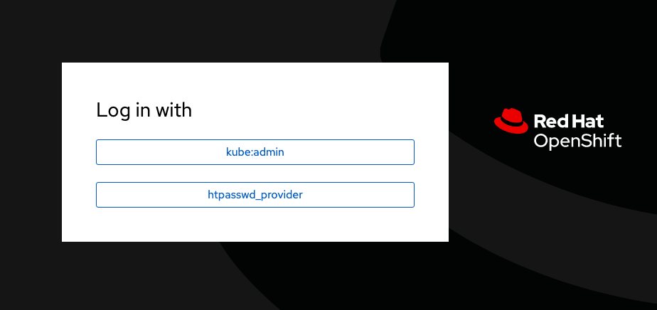

=== Verify Managed clusters which are imported correctly
Select All Clusters and verify that you can see local and two managed clusters - primnary and secondary

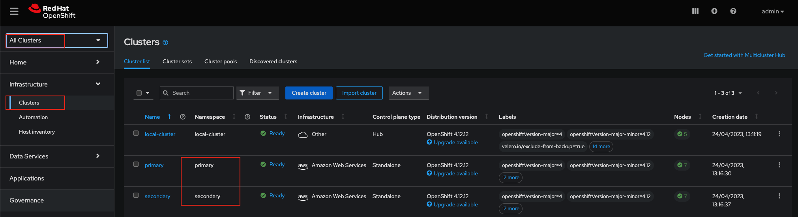

=== Verify Managed clusters have non-overlapping networks

In order to connect the OpenShift cluster and service networks using the `Submariner add-ons`, it is necessary to validate the two clusters have non-overlapping networks. This can be done by running the following command for each of the managed clusters and check the spec section as shown below. Accept insecure connection as we know its the managed cluster in the lab environment.

For that you have a terminal window along with your workshop modules. You can use api login to respective cluster.
If you want you can also ssh to each cluster separately using mutliple terminal windows outside of this browser based termninal window.

For primary :
[source,role="execute"]
----
oc login -u %primary_openshift_cluster_admin_username% -p %primary_openshift_cluster_admin_password% %primary_openshift_api_server_url%
----

[source,role="execute"]
----
oc get networks.config.openshift.io cluster -o json | jq .spec
----
.Example output for ocp4bos1:
[source,json]
----
{
  "clusterNetwork": [
    {
      "cidr": "10.128.0.0/14",
      "hostPrefix": 23
    }
  ],
  "externalIP": {
    "policy": {}
  },
  "networkType": "OpenShiftSDN",
  "serviceNetwork": [
    "172.30.0.0/16"
  ]
}
----

For Secondary:
[source,role="execute"]
----
oc login -u %secondary_openshift_cluster_admin_username% -p %secondary_openshift_cluster_admin_password% %secondary_openshift_api_server_url%
----

[source,role="execute"]
----
oc get networks.config.openshift.io cluster -o json | jq .spec
----

.Example output for ocp4bos2:
[source,json]
----
{
  "clusterNetwork": [
    {
      "cidr": "10.200.0.0/14",
      "hostPrefix": 23
    }
  ],
  "externalIP": {
    "policy": {}
  },
  "networkType": "OpenShiftSDN",
  "serviceNetwork": [
    "172.31.0.0/16"
  ]
}
----

These outputs show that the two example managed clusters have non-overlapping `clusterNetwork` and `serviceNetwork` ranges so it is safe to proceed.

=== Connect the Managed clusters using Submariner add-ons

Now that we know the `cluster` and `service` networks have non-overlapping ranges, it is time to verify the `Submariner add-ons` for each managed cluster. This is done by using the ACM console and `Cluster sets`.

Navigate to selection shown below and at the bottom of the same page, select *Create cluster set*.

A successful deployment will show `Connection status` and `Agent status` as `Healthy`.

.ACM Submariner add-ons installed
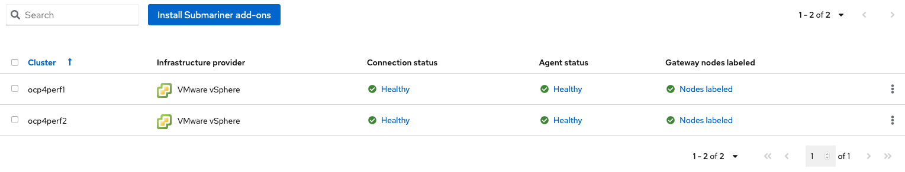

== OpenShift Data Foundation Installation

In order to configure storage replication between the two OCP clusters `OpenShift Data Foundation` (ODF) must be installed first on each managed cluster. ODF deployment guides and instructions are specific to your infrastructure (i.e. AWS, VMware, BM, Azure, etc.). Install ODF version *4.12* on both OCP managed clusters.

You can validate the successful deployment of ODF on each managed OCP cluster with the following command:
For primary :
[source,role="execute"]
----
oc login -u %primary_openshift_cluster_admin_username% -p %primary_openshift_cluster_admin_password% %primary_openshift_api_server_url%
----

[source,role="execute"]
----
oc get storagecluster -n openshift-storage ocs-storagecluster -o jsonpath='{.status.phase}{"\n"}'
----

And for the Multi-Cluster Gateway (MCG):

[source,role="execute"]
----
oc get noobaa -n openshift-storage noobaa -o jsonpath='{.status.phase}{"\n"}'
----

For Secondary:
[source,role="execute"]
----
oc login -u %secondary_openshift_cluster_admin_username% -p %secondary_openshift_cluster_admin_password% %secondary_openshift_api_server_url%
----

[source,role="execute"]
----
oc get storagecluster -n openshift-storage ocs-storagecluster -o jsonpath='{.status.phase}{"\n"}'
----

And for the Multi-Cluster Gateway (MCG):

[source,role="execute"]
----
oc get noobaa -n openshift-storage noobaa -o jsonpath='{.status.phase}{"\n"}'
----

Verify that the result is `Ready` for both queries on the *Primary managed cluster* and the *Secondary managed cluster*.

NOTE: The successful installation of ODF can also be validated in the *OCP Web Console* by navigating to *Storage* and then *Data Foundation*.

== Verify ODF Multicluster Orchestrator Operator on Hub cluster

Check to see the following operators *Pod* are in a `Running` state. You may also see other operator pods which are not related to Regional DR configuration.

For Hub:
[source,role="execute"]
----
oc login -u %hub_openshift_cluster_admin_username% -p %hub_openshift_cluster_admin_password% %hub_openshift_api_server_url%
----

[source,role="execute"]
----
oc get pods -n openshift-operators
----
.Example output.
----
NAME                                       READY   STATUS    RESTARTS   AGE

odfmo-controller-manager-f6fc95f7f-7wtjl   1/1     Running   0          4m14s
ramen-hub-operator-85465bd487-7sl2k        2/2     Running   0          3m40s
odf-multicluster-console-76b88b444c-vl9s4  1/1     Running   0          3m50s
----

== Configure SSL access between S3 endpoints

This are necessary so that metadata can be stored on the alternate cluster in a Multi-Cloud Gateway (MCG) object bucket using a secure transport protocol and in addition the *Hub cluster* needs to verify access to the object buckets.

NOTE: If all of your OpenShift clusters are deployed using signed and valid set of certificates for your environment then this is not required.

== Create Data Policy on Hub cluster

Regional Disaster Recovery uses the *DRPolicy* resources on the *Hub cluster* to failover and relocate workloads across managed clusters. A *DRPolicy* requires a set of two *DRClusters* or peer clusters with *ODF* version 4.12 installed. The `ODF MultiCluster Orchestrator Operator` facilitates the creation of each *DRPolicy* and the corresponding *DRClusters* through the *Multicluster Web console*.

On the *Hub cluster* navigate to `All Clusters`. Then navigate to *Data policies* under Data services menu. If this your first *DRPolicy* created you will see *Create DRpolicy* at the bottom of the page, else you will the the already created DRPolicy.

IMPORTANT: Make sure you can access all clusters from the *Multicluster Web console*. The clusters will be directly below `All Clusters`.

.Multicluster console Data policies
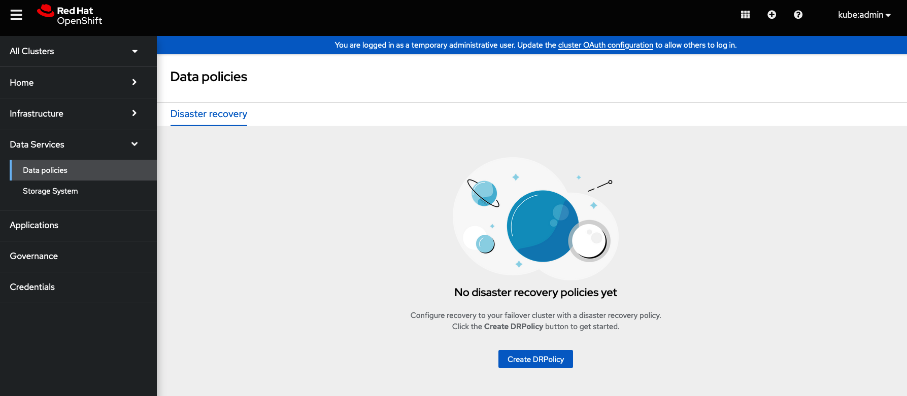

Click on *Data policies* and review the already created drpolicy named `drsync5m` 

.DRPolicy select peer clusters 
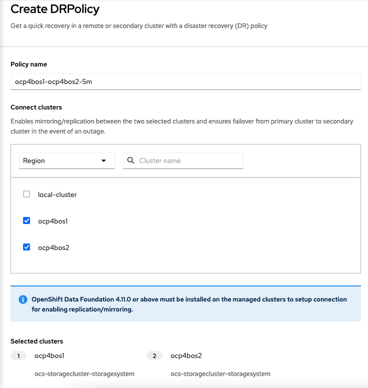

The greyed out dropdown option for `Replication policy` will automatically be selected as *async* based on the OpenShift clusters selected and a *Sync schedule* will be available. Select the replication interval for this *DRPolicy* and then select *Create*.

.DRPolicy select replication interval 
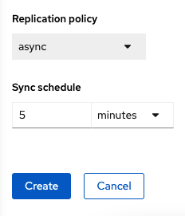

NOTE: For every desired replication interval a new *DRPolicy* needs to be created with a unique name (i.e., ocp4bos1-ocp4bos2-10m). The same clusters could be selected but the *Sync schedule* would be configured with a different replication interval in minutes. The minimum is one minute.

This should create the two *DRCluster* resources and also the *DRPolicy* on the *Hub cluster*. In addition, when the initial *DRPolicy* is created the following will happen:

* Create a bootstrap token and exchanges this token between the managed clusters.
* Enable mirroring for the default `CephBlockPool` on each managed clusters.
* Create a *VolumeReplicationClass* on the *Primary managed cluster* and the *Secondary managed cluster* for the replication interval in the DRPolicy.
* An object bucket created (using MCG) on each managed cluster for storing *PVC* and *PV* metadata.
* A *Secret* created in the `openshift-operators` project on the *Hub cluster* for each new object bucket that has the base64 encoded access keys.
* The `ramen-hub-operator-config` *ConfigMap* on the *Hub cluster* is modified with `s3StoreProfiles` entries.
* The `OpenShift DR Cluster` operator will be deployed on each managed cluster in the `openshift-dr-system` project.
* The object buckets *Secrets* on the *Hub cluster* in the project `openshift-operators` will be copied to the managed clusters in the `openshift-dr-system` project.
* The `s3StoreProfiles` entries will be copied to the managed clusters and used to modify the `ramen-dr-cluster-operator-config` *ConfigMap* in the `openshift-dr-system` project.

To validate that the *DRPolicy* is created successfully run this command on the *Hub cluster* for the each *Data Policy* resource created. 

NOTE: Replace `<drpolicy_name>` with your unique name.

For Hub (drpolicy name is drsync5m):
[source,role="execute"]
----
oc login -u %hub_openshift_cluster_admin_username% -p %hub_openshift_cluster_admin_password% %hub_openshift_api_server_url%
----

[source,role="execute"]
----
oc get drpolicy drsync5m -o jsonpath='{.status.conditions[].reason}{"\n"}'
----
.Example output.
----
Succeeded
----

To validate object bucket access from the *Hub cluster* to both the *Primary managed cluster* and the *Secondary managed cluster* first get the names of the *DRClusters* on the *Hub cluster*.

[source,role="execute"]
----
oc get drclusters
----
.Example output.
----
NAME        AGE
primary     4m42s
secondary   4m42s
----

Now test S3 access to each bucket created on each managed cluster using this *DRCluster* validation command.

NOTE: Replace `<drcluster_name>` with your unique name.

[source,role="execute"]
----
oc get drcluster primary -o jsonpath='{.status.conditions[2].reason}{"\n"}'
----
.Example output.
----
Succeeded
----

[source,role="execute"]
----
oc get drcluster secondary -o jsonpath='{.status.conditions[2].reason}{"\n"}'
----
.Example output.
----
Succeeded
----

NOTE: Make sure to run command for both *DRClusters* on the *Hub cluster*.

To validate that the `OpenShift DR Cluster` operator installation was successful on the *Primary managed cluster* and the *Secondary managed cluster* check for CSV `odr-cluster-operator` and pod `ramen-dr-cluster-operator` by running the following command:

For primary :
[source,role="execute"]
----
oc login -u %primary_openshift_cluster_admin_username% -p %primary_openshift_cluster_admin_password% %primary_openshift_api_server_url%
----
[source,role="execute"]
----
oc get csv,pod -n openshift-dr-system
----
.Example output.
----
NAME                                                                      DISPLAY                         VERSION   REPLACES   PHASE
clusterserviceversion.operators.coreos.com/odr-cluster-operator.v4.11.0   Openshift DR Cluster Operator   4.11.0               Succeeded

NAME                                             READY   STATUS    RESTARTS   AGE
pod/ramen-dr-cluster-operator-5564f9d669-f6lbc   2/2     Running   0          5m32s
----

For Secondary:
[source,role="execute"]
----
oc login -u %secondary_openshift_cluster_admin_username% -p %secondary_openshift_cluster_admin_password% %secondary_openshift_api_server_url%
----

[source,role="execute"]
----
oc get csv,pod -n openshift-dr-system
----
.Example output.
----
NAME                                                                      DISPLAY                         VERSION   REPLACES   PHASE
clusterserviceversion.operators.coreos.com/odr-cluster-operator.v4.11.0   Openshift DR Cluster Operator   4.11.0               Succeeded

NAME                                             READY   STATUS    RESTARTS   AGE
pod/ramen-dr-cluster-operator-5564f9d669-f6lbc   2/2     Running   0          5m32s
----

You can also go to *OperatorHub* on each of the managed clusters and look to see the `OpenShift DR Cluster Operator` is installed.

.ODR Cluster Operator
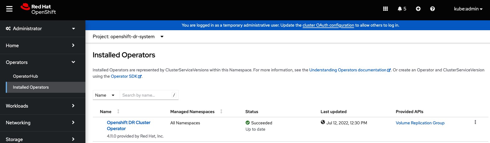

Validate the status of the *ODF* mirroring `daemon` health on the *Primary managed cluster* and the *Secondary managed cluster*.

[source,role="execute"]
----
oc get cephblockpool ocs-storagecluster-cephblockpool -n openshift-storage -o jsonpath='{.status.mirroringStatus.summary}{"\n"}'
----
.Example output.
----
{"daemon_health":"OK","health":"OK","image_health":"OK","states":{}}
----

CAUTION: It could take up to 10 minutes for the `daemon_health` and `health` to go from *Warning* to *OK*. If the status does not become *OK* eventually then use the ACM console to verify that the `Submariner` connection between managed clusters is still in a healthy state. Do not proceed until all values are *OK*. 

== Create Sample Application for DR testing

In order to test failover from the *Primary managed cluster* to the *Secondary managed cluster* and back again we need a simple application. The sample application used for this example with be `busybox`. 

=== Creating Sample Application using ACM console

Start by loggin into the ACM console using your OpenShift credentials if not already logged in.

[source,role="execute"]
----
oc get route multicloud-console -n open-cluster-management -o jsonpath --template="https://{.spec.host}/multicloud/applications{'\n'}"
----

This will return a route similar to this one.

.Example Output:
----
https://multicloud-console.apps.bos3.example.com/multicloud/applications
----

After logging in select *Create application* in the top right and choose *Subscription*.

.ACM Create application
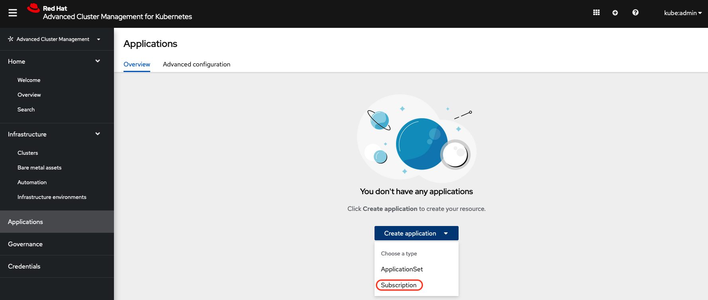

Fill out the top of the `Create an application` form as shown below and select repository type *Git*.

.ACM Application name and namespace
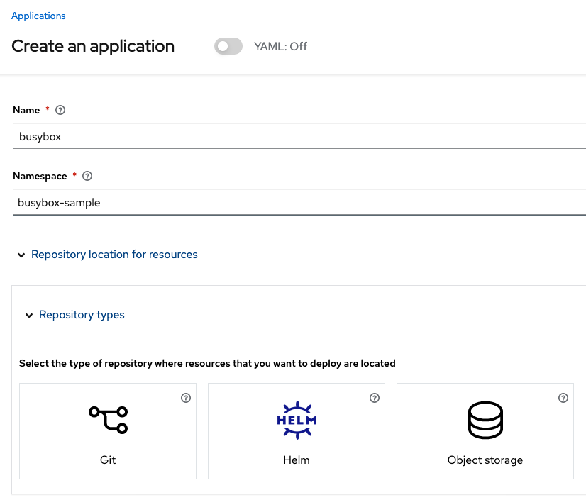

The next section to fill out is below the *Git* box and is the repository URL for the sample application, the *github* branch and path to resources that will be created, the `busybox` *Pod* and *PVC*. 

NOTE: *Sample application repository* https://github.com/RamenDR/ocm-ramen-samples. Branch is `main` and path is `busybox-odr`. 

.ACM application repository information
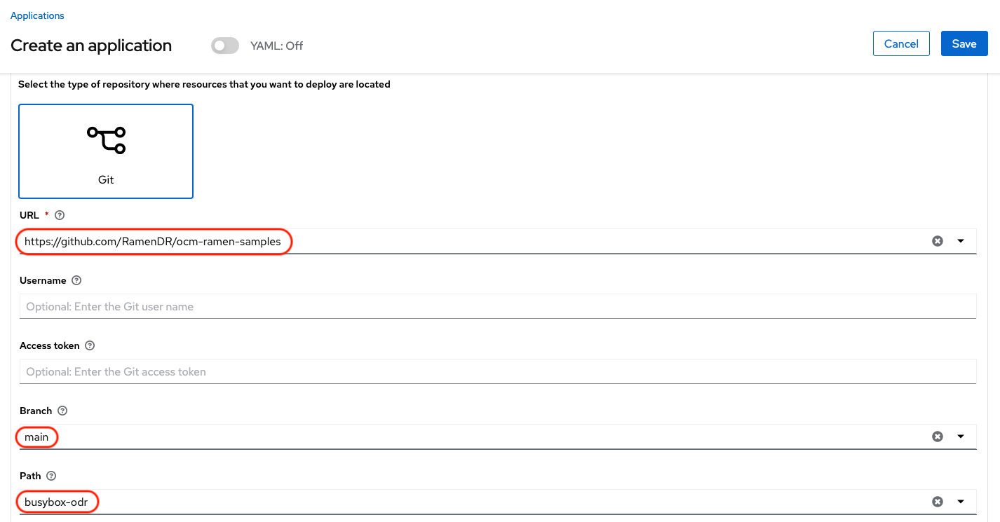

Scroll down in the form until you see *Deploy application resources only on clusters matching specified labels* and then add a label for the *Primary managed cluster* name in *RHACM* cluster list view.

.ACM Select cluster for deployment 
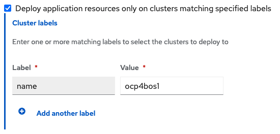

After adding the `Label` to identify the cluster, select *Save* in the upper right hand corner.

On the follow-on screen go to the `Topology` tab. You should see that there are all *Green* checkmarks on the application topology.

.ACM application successful topology view
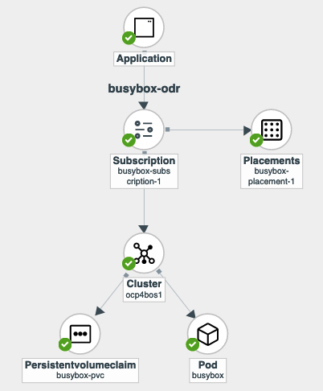

NOTE: To get more information click on any of the topology elements and a window will appear to right of the topology view.

=== Validating Sample Application deployment

Now that the `busybox` application has been deployed to your *Primary managed cluster* the deployment can be validated.

Logon to your managed cluster where `busybox` was deployed by ACM. This is most likely your *Primary managed cluster*.

[source,role="execute"]
----
oc get pods,pvc -n busybox-sample
----
.Example output.
----
NAME          READY   STATUS    RESTARTS   AGE
pod/busybox   1/1     Running   0          6m

NAME                                STATUS   VOLUME                                     CAPACITY   ACCESS MODES   STORAGECLASS                  AGE
persistentvolumeclaim/busybox-pvc   Bound    pvc-a56c138a-a1a9-4465-927f-af02afbbff37   1Gi        RWO            ocs-storagecluster-ceph-rbd   6m
----

=== Apply DRPolicy to Sample Application

On the *Hub cluster* go back to the *Multicluster Web console* and select `All Clusters` in the top right hand corner. 

IMPORTANT: Make sure to login to all clusters from the *Multicluster Web console*. The clusters will be directly below `All Clusters`.

Navigate to `Data Services` and then choose `Data policies`. You should see the *DRPolicy* you created earlier in these instructions, section <<Create Data Policy on Hub cluster>>. At the far right of the *DRPolicy* select the vertical dots as shown below. 

.Apply DRPolicy
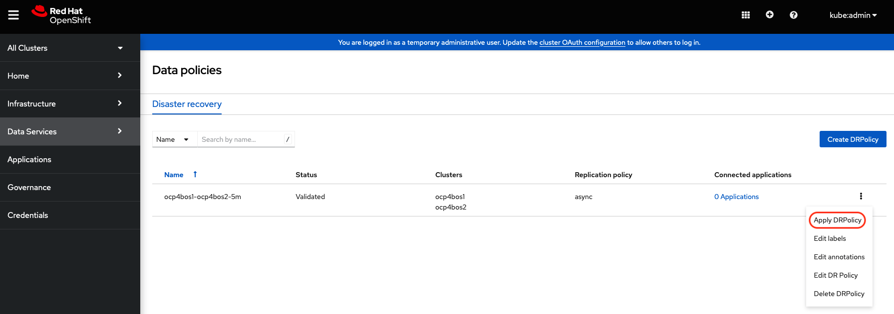

When the *Apply DRPolicy* box appears select `busybox` and then *Apply*.

.DRPolicy select application
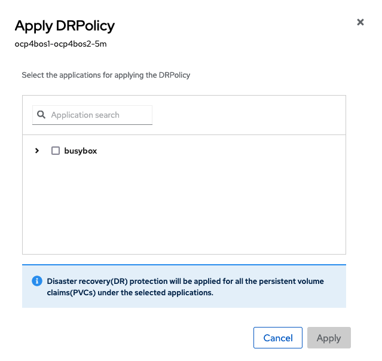

Validate that a `DRPlacementControl` or `DRPC` was created in the `busybox-sample` namespace on the *Hub cluster*. This resource is used for both `failover` and `failback` actions for this application.

[source,role="execute"]
----
oc get drpc -n busybox-sample
----
.Example output.
----
NAME                       AGE     PREFERREDCLUSTER   FAILOVERCLUSTER   DESIREDSTATE   CURRENTSTATE
busybox-placement-1-drpc   6m59s   ocp4bos1                                           Deployed
----

=== Deleting the Sample Application

Deleting the `busybox` application can be done using the ACM console. Navigate to *Applications* and then find the application to be deleted (busybox in this case).

NOTE: The instructions to delete the sample application should not be executed until the failover and failback (relocate) testing is completed and you want to remove this application from RHACM and from the managed clusters.

.ACM delete busybox application
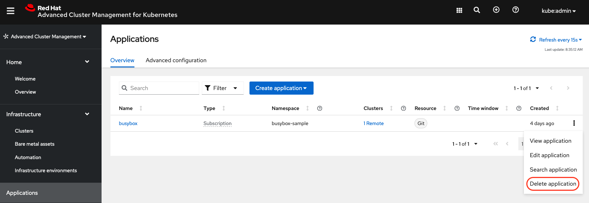

When *Delete application* is selected a new screen will appear asking if the `application related resources` should also be deleted. Make sure to `check` the box to delete the `Subscription` and `PlacementRule`.

.ACM delete busybox application resources
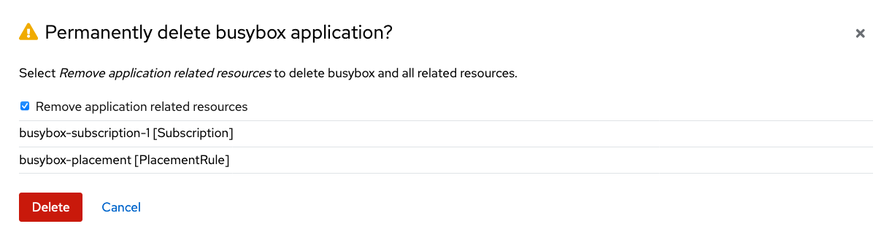

Select *Delete* in this screen. This will delete the `busybox` application on the *Primary managed cluster* (or whatever cluster the application was running on).

In addition to the resources deleted using the ACM console, the `DRPlacementControl` must also be deleted immediately after deleting the `busybox` application. Logon to the OpenShift Web console for the *Hub cluster*. Navigate to `Installed Operators` for the project `busybox-sample`. Choose `OpenShift DR Hub Operator` and the *DRPlacementControl*.

.Delete busybox application DRPlacementControl
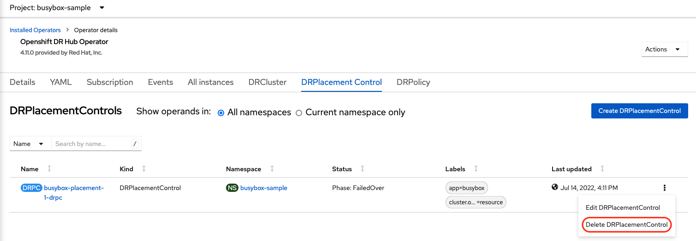

Select *Delete DRPlacementControl*. 

NOTE: If desired, the `DRPlacementControl` resource can also be deleted in the application namespace using CLI.

NOTE: This process can be used to delete any application with a DRPlacementControl resource.

== Application Failover between managed clusters

This section will detail how to failover the `busybox` sample application. The failover method for `Metro Disaster Recovery` is application based. Each application that is to be protected in this manner must have a corresponding *DRPlacementControl* in the application namespace as shown in the <<Apply DRPolicy to Sample Application>> section.

=== Modify DRPlacementControl to failover

To failover requires modifying the *DRPlacementControl* YAML view. On the *Hub cluster* navigate to `Installed Operators` and then to `Openshift DR Hub Operator`. Select *DRPlacementControl* as show below.

NOTE: Make sure to be in the `busybox-sample` namespace.

.DRPlacementControl busybox instance
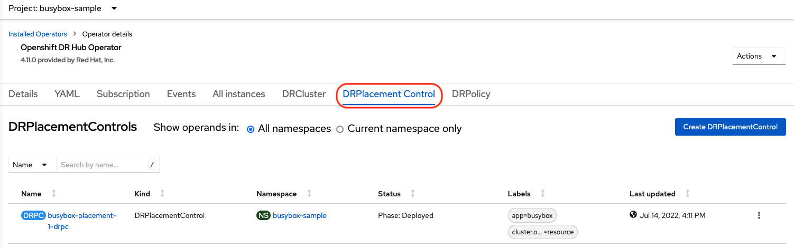

Select `busybox-placement-1-drpc` and then the YAML view. Add the `action` and `failoverCluster` as shown below. The `failoverCluster` should be the *ACM* cluster name for the *Secondary managed cluster*.

.DRPlacementControl add action Failover

Select *Save*.

In the `failoverCluster` specified in the YAML file (i.e., ocp4bos2), see if the application `busybox` is now running in the *Secondary managed cluster* using the following command:

[source,role="execute"]
----
oc get pods,pvc -n busybox-sample
----
.Example output.
----
NAME          READY   STATUS    RESTARTS   AGE
pod/busybox   1/1     Running   0          35s

NAME                                STATUS   VOLUME                                     CAPACITY   ACCESS MODES   STORAGECLASS                  AGE
persistentvolumeclaim/busybox-pvc   Bound    pvc-79f2a74d-6e2c-48fb-9ed9-666b74cfa1bb   5Gi        RWO            ocs-storagecluster-ceph-rbd   35s
----

Next, using the same command check if `busybox` is running in the *Primary managed cluster*. The `busybox` application should no longer be running on this managed cluster.

[source,role="execute"]
----
oc get pods,pvc -n busybox-sample
----
.Example output.
----
No resources found in busybox-sample namespace.
----

== Application Failback between managed clusters

A failback operation is very similar to failover. The failback is application based and again uses the *DRPlacementControl* `action` value to trigger the failback. In this case the `action` is *Relocate* to the `preferredCluster`. 

=== Modify DRPlacementControl to failback

To failback requires modifying the *DRPlacementControl* YAML view. On the *Hub cluster* navigate to `Installed Operators` and then to `Openshift DR Hub Operator`. Select *DRPlacementControl* as show below.

NOTE: Make sure to be in the `busybox-sample` namespace.

.DRPlacementControl busybox instance

Select `busybox-placement-1-drpc` and then the YAML form. Modify the `action` to `Relocate` as shown below.

.DRPlacementControl modify action to Relocate
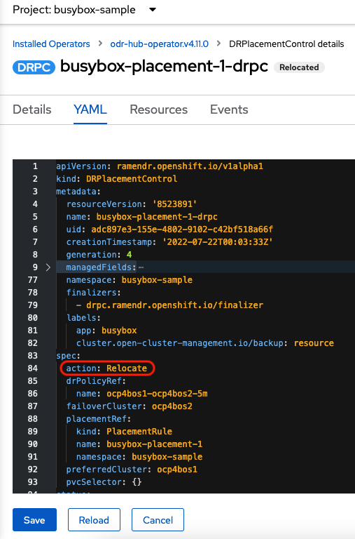

Select *Save*.

Check if the application `busybox` is now running in the *Primary managed cluster* using the following command. The failback is to the `preferredCluster` which should be where the application was running before the failover operation.

[source,role="execute"]
----
oc get pods,pvc -n busybox-sample
----
.Example output.
----
NAME          READY   STATUS    RESTARTS   AGE
pod/busybox   1/1     Running   0          60s

NAME                                STATUS   VOLUME                                     CAPACITY   ACCESS MODES   STORAGECLASS                  AGE
persistentvolumeclaim/busybox-pvc   Bound    pvc-79f2a74d-6e2c-48fb-9ed9-666b74cfa1bb   5Gi        RWO            ocs-storagecluster-ceph-rbd   61s
----

Next, using the same command, check if `busybox` is running in the *Secondary managed cluster*. The `busybox` application should no longer be running on this managed cluster.

[source,role="execute"]
----
oc get pods,pvc -n busybox-sample
----
.Example output.
----
No resources found in busybox-sample namespace.
----
